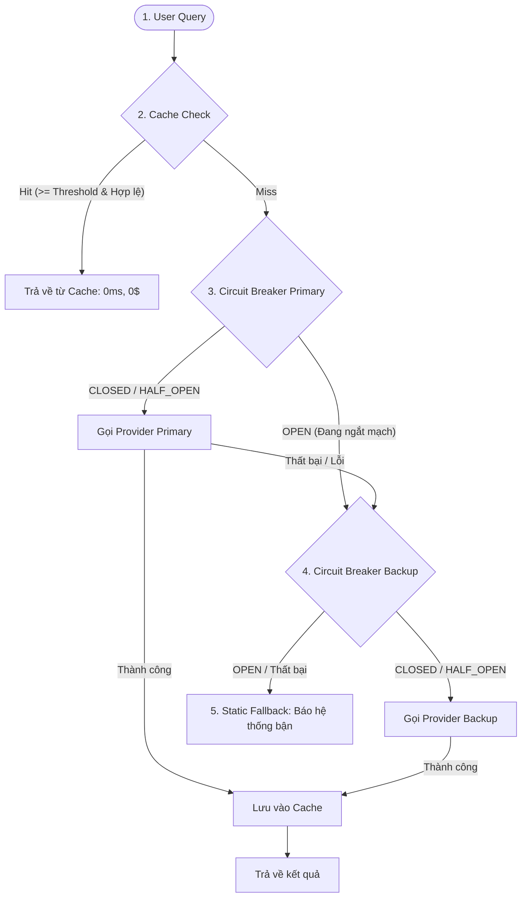

# TỔNG HỢP KIẾN THỨC CỐT LÕI (RELIABILITY ENGINEERING LAB)

---

## 1. Mục Tiêu Dự Án: Reliability Gateway là gì?
Là một **Cổng tiếp nhận & điều phối (Gateway)** đứng giữa Người dùng và các Nhà cung cấp AI (LLM Providers như OpenAI, Claude). 
- **Mục tiêu:** Giảm chi phí (0$), giảm độ trễ (0ms) bằng Cache; tự động ngắt kết nối khi Provider lỗi (Circuit Breaker); tự chuyển sang Provider dự phòng (Fallback) để không bao giờ làm sập ứng dụng.

---

## 2. Sơ Đồ Luồng Xử Lý Của 1 Request

---

## 3. Các Khái Niệm Cốt Lõi

### A. Semantic Cache (Bộ nhớ đệm ngữ nghĩa)
* **Ý tưởng:** Nếu câu hỏi mới tương tự câu đã từng hỏi (dù khác chữ), lấy luôn câu trả lời cũ ra trả về.
* **N-gram & Cosine Similarity:** Cắt câu thành các mảnh 3 ký tự (ví dụ `"hel"`, `"ell"`), đếm tần suất và tính góc Cosine để ra điểm từ `0.0` (khác hẳn) đến `1.0` (giống hệt).
* **Privacy Guardrails (Rào chắn bảo mật):** Câu có chứa `password`, `ssn`, `balance`, `credit card`... thì **không bao giờ lưu cache / không đọc cache**.
* **False-hit Detection (Chống khớp nhầm):** Nếu 2 câu lệch nhau về con số/năm (ví dụ *năm 2024* vs *năm 2026*) thì dù độ tương đồng cao vẫn coi là **khác nghĩa**, từ chối cache.

### B. Circuit Breaker (Cầu dao điện / Aptomat 3 trạng thái)
Giúp hệ thống "ngã nhanh" (Fail Fast) khi một Provider bị sập, tránh gửi dồn dập làm nghẽn mạng (Retry Storm).
* **`CLOSED` (Đóng mạch):** Trạng thái bình thường. Cho request đi qua. Nếu lỗi liên tiếp $\ge$ `failure_threshold` $\rightarrow$ Chuyển sang `OPEN`.
* **`OPEN` (Ngắt mạch):** Chặn toàn bộ request ngay lập tức (không gọi sang Provider). Đợi hết `reset_timeout_seconds` $\rightarrow$ Chuyển sang `HALF_OPEN`.
* **`HALF_OPEN` (Hé mở thăm dò):** Cho đúng 1 request đi qua thử:
  * Nếu thành công $\ge$ `success_threshold` $\rightarrow$ Về `CLOSED` (lý do: `"probe_success"`).
  * Nếu thất bại $\rightarrow$ Quay lại `OPEN` ngay lập tức (lý do: `"probe_failure"`).

### C. Fallback Chain (Chuỗi dự phòng)
* **Primary:** Nhà cung cấp chính (tốt nhất).
* **Backup:** Nhà cung cấp dự phòng (khi Primary bị lỗi hoặc ngắt mạch).
* **Static Fallback:** Cả Primary và Backup đều chết $\rightarrow$ Trả về câu thông báo nhẹ nhàng: *"Dịch vụ tạm thời gián đoạn..."*.

### D. Shared Redis Cache (Cache phân tán)
* **In-memory cache:** Lưu trong RAM của 1 máy (máy khác không thấy).
* **Redis cache:** Lưu trong DB Redis dùng chung cho nhiều server (Multi-instance), có TTL (tự hủy sau một thời gian).

### E. Chaos Testing & SRE Metrics
* **Chaos Testing:** Cố tình giả lập mạng chập chờn, lỗi 100% để kiểm tra độ chịu tải và khả năng tự phục hồi.
* **Availability:** Tỉ lệ request thành công / Tổng request.
* **Latency P50 / P95 / P99:** 
  * P50: Mức trung vị (50% người dùng nhận kết quả nhanh hơn mức này).
  * P95/P99: Đo 5% và 1% các trường hợp bị chậm nhất để đánh giá lúc nghẽn mạng.
* **Recovery Time (MTTR):** Thời gian tính từ lúc Circuit Breaker chuyển `OPEN` đến khi chuyển về `CLOSED` (tính bằng ms).

---

## 4. Bản Đồ File Cần Làm (5 Files)

| File | Nhiệm vụ chính |
|:---|:---|
| `circuit_breaker.py` | Cài đặt 4 hàm: `allow_request()`, `call()`, `record_success()`, `record_failure()`. |
| `cache.py` | Cài đặt `similarity()` (n-gram cosine), `get()`, `set()` cho Memory Cache và Redis Cache. |
| `gateway.py` | Cài đặt `complete()` kết nối Cache $\rightarrow$ Circuit Breaker $\rightarrow$ Fallback $\rightarrow$ Static Fallback. |
| `chaos.py` | Cài đặt `run_scenario()` và `calculate_recovery_time_ms()`. |
| `metrics.py` | Cài đặt `write_csv()` xuất báo cáo. |

---

## 5. Lưu Ý Kỹ Thuật Quan Trọng (Bẫy Thường Gặp)
1. **`record_failure()` trong Circuit Breaker:** Phải tách riêng 2 trường hợp `if state == HALF_OPEN` (lý do `"probe_failure"`) và `elif failure_count >= threshold` (lý do `"failure_threshold_reached"`). Không được gộp chung bằng `or`.
2. **Thời gian đo Circuit Breaker:** Dùng `time.monotonic()` để đo khoảng cách thời gian trôi qua, không bị ảnh hưởng bởi đổi giờ hệ thống.
3. **Privacy & False-hit:** Phải kiểm tra trước khi lấy dữ liệu từ cache ra và trước khi ghi dữ liệu vào cache.
