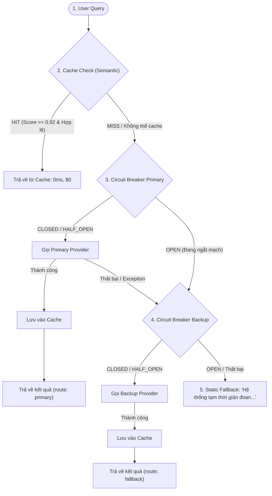
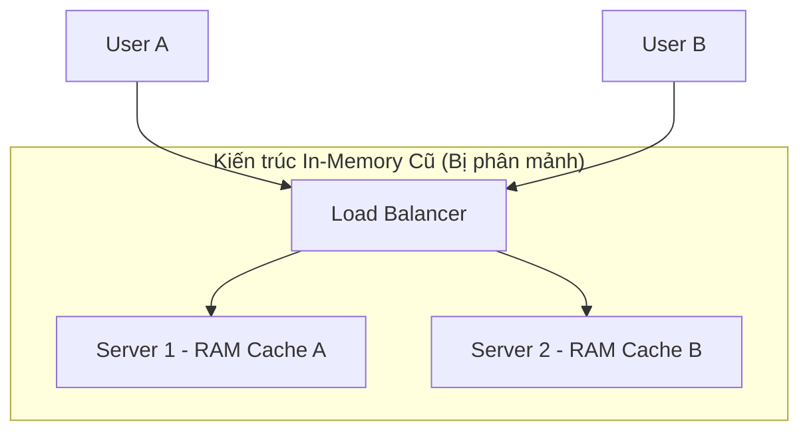
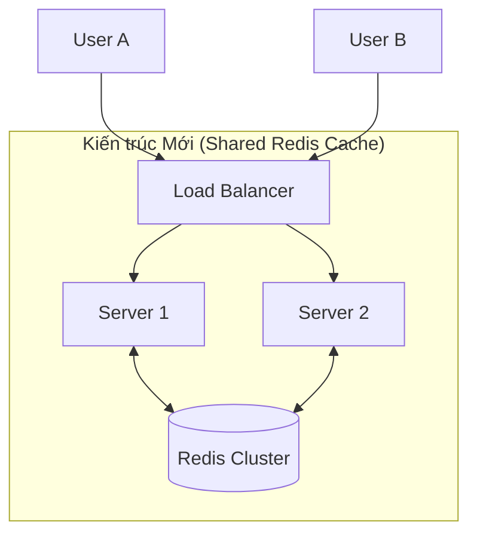

# 📘 TỔNG HỢP KIẾN THỨC CỐT LÕI (RELIABILITY ENGINEERING FOR AI AGENTS)

Tài liệu này tổng hợp toàn bộ kiến thức, kiến trúc, sơ đồ trực quan và bài học thực tế từ dự án **Reliability Engineering for Production Agents**.

---

## 1. Mục Tiêu Dự Án: Reliability Gateway là gì?

Khi gọi các mô hình AI (OpenAI, Anthropic, Gemini, Local LLM), hệ thống thường gặp:
- **Độ trễ và chi phí cao:** Câu hỏi lặp lại nhiều lần vẫn phải gọi lên AI tốn tiền ($) và mất thời gian chờ (vài giây).
- **API bị sập / Rate Limit (429, 5xx):** Khi nhà cung cấp AI gặp sự cố, ứng dụng có thể bị treo hoặc sập theo.
- **Rủi ro bảo mật & Sai lệch dữ liệu:** Dữ liệu nhạy cảm (mật khẩu, số tài khoản) bị lưu bừa bãi; câu hỏi năm 2024 lại trả lời bằng dữ liệu năm 2026.

👉 **Reliability Gateway** là một **Cổng tiếp nhận & điều phối thông minh**, đóng vai trò là "người bảo vệ" đứng trước các LLM Providers để mang lại hệ thống **chịu lỗi cao (Fault-tolerant), tiết kiệm chi phí và luôn sẵn sàng 99.9%**.

---

## 2. Sơ Đồ Kiến Trúc Toàn Thể Của Gateway



---

## 3. Máy Trạng Thái Của Circuit Breaker (Cầu Dao Điện 3 Trạng Thái)

Circuit Breaker bảo vệ hệ thống theo nguyên lý **Fail-Fast** (Ngã nhanh để không làm nghẽn hàng đợi / chống bão retry).

```mermaid
stateDiagram-v2
    [*] --> CLOSED : Khởi động ban đầu
    
    CLOSED --> OPEN : Gặp lỗi liên tiếp >= failure_threshold (Lý do: failure_threshold_reached)
    note right of CLOSED : Mạch đóng: Mọi request đi qua bình thường
    
    OPEN --> HALF_OPEN : Hết thời gian phạt reset_timeout_seconds (Dùng time.monotonic)
    note right of OPEN : Mạch ngắt: Chặn ngay lập tức, ném CircuitOpenError
    
    HALF_OPEN --> CLOSED : Gọi thử thành công >= success_threshold (Lý do: probe_success)
    HALF_OPEN --> OPEN : Gọi thử lại thất bại ngay lập tức (Lý do: probe_failure)
    note right of HALF_OPEN : Thử nghiệm: Cho đúng 1 request thăm dò (probe)
```

### 📌 Bẫy code quan trọng trong Circuit Breaker:
- **Tách riêng `if/elif`:** Phải phân biệt rõ `reason="probe_failure"` (khi đang ở `HALF_OPEN`) và `reason="failure_threshold_reached"` (khi đang ở `CLOSED`). Tuyệt đối không gộp bằng `or`.
- **Đo thời gian trôi qua:** Sử dụng `time.monotonic()` thay vì `time.time()` để không bị ảnh hưởng bởi việc đổi múi giờ hoặc đồng bộ NTP của hệ điều hành.

---

## 4. Semantic Cache & Hai Chiếc "Kính Lọc" An Toàn

### A. Thuật toán Cosine N-Gram Similarity
Không so khớp chuỗi thô (`a == b`), ta tách chuỗi thành:
1. **Word tokens:** `text.lower().split()`
2. **Character 3-grams:** `"refund"` $\rightarrow$ `["ref", "efu", "fun", "und"]`
3. Đếm tần suất với `Counter` và tính góc Cosine giữa 2 vector:
   $$\text{Cosine}(A, B) = \frac{\sum (A_i \times B_i)}{\sqrt{\sum A_i^2} \times \sqrt{\sum B_i^2}}$$

### B. Hai Lớp Bảo Vệ Bắt Buộc:
1. **🛡️ Privacy Guardrails (`_is_uncacheable`):**
   - Chặn các câu chứa từ khóa nhạy cảm: `password`, `ssn`, `balance`, `credit card`, `user_\d+`...
   - **Quy tắc:** Không đọc từ cache và không bao giờ lưu vào cache.
2. **🛡️ False-Hit Detection (`_looks_like_false_hit`):**
   - Phát hiện các câu có độ tương đồng ngữ nghĩa cao nhưng **khác nhau về số/năm 4 chữ số** (ví dụ: *Năm 2024* vs *Năm 2026*).
   - **Quy tắc:** Từ chối Cache và ghi vào `false_hit_log` với lý do `"date_or_number_mismatch"`.

---

## 5. So Sánh In-Memory Cache vs Shared Redis Cache

### ❌ Khi dùng In-Memory Cache (Bị phân mảnh):
Khi triển khai nhiều Server (Multi-instance), mỗi server có một vùng RAM riêng biệt:


*Nhược điểm:* Server 1 đã cache câu trả lời nhưng Server 2 không biết, dẫn đến gọi trùng lặp lên LLM và tốn chi phí.

---

### ✅ Khi dùng Shared Redis Cache (Bộ nhớ dùng chung):
Dùng cơ sở dữ liệu in-memory tập trung (Redis Cluster) đặt ở giữa:


*Ưu điểm:*
- **Chia sẻ tức thì:** Bất kỳ server nào xử lý câu hỏi đều lưu vào Redis để mọi server khác dùng chung.
- **Tự động dọn rác (TTL):** Redis dùng lệnh `EXPIRE` tự xóa key khi hết hạn, code Python không cần dọn rác thủ công.
- **Key Hashing:** Dùng hàm băm MD5 ngắn `rl:cache:md5(query)` để tạo khóa truy xuất $O(1)$.

---

## 6. Docker & Containerization (Hộp Thần Kỳ)

- **Docker là gì?** Đóng gói toàn bộ (Hệ điều hành Linux thu nhỏ + Phần mềm + Cấu hình) vào một "thùng container" độc lập.
- **Vai trò trong bài lab:** `docker-compose.yml` bật ngay một máy chủ `redis:7-alpine` chỉ bằng lệnh:
  ```bash
  docker compose up -d
  ```
  *(Khi dùng xong, gõ `docker compose down` để dọn sạch sẽ, không để lại file rác).*

---

## 7. Chaos Testing & Các Chỉ Số SRE Cốt Lõi

### A. Ba Kịch Bản Chaos:
1. `primary_timeout_100`: Primary sập 100% $\rightarrow$ Kiểm tra Circuit Breaker ngắt mạch và toàn bộ lưu lượng chuyển sang Backup.
2. `primary_flaky_50`: Primary chập chờn 50% $\rightarrow$ Kiểm tra Circuit Breaker dao động nhịp nhàng và tự phục hồi.
3. `all_healthy`: Trạng thái bình thường $\rightarrow$ Đo đạc baseline chuẩn.

### B. Bảng Chỉ Số Đo Lường:
- **Availability (Độ sẵn sàng):** Tỉ lệ request thành công / Tổng request (Mục tiêu $\ge 99\%$).
- **P50 / P95 / P99 Latency:** 
  - **P50:** Độ trễ trung vị của 50% người dùng.
  - **P95 / P99:** Đo 5% và 1% các trường hợp bị chậm nhất khi nghẽn mạng để đảm bảo trải nghiệm người dùng lúc tồi tệ nhất.
- **Recovery Time (MTTR):** Thời gian tính từ lúc Circuit Breaker chuyển `OPEN` đến khi chuyển về `CLOSED` (tính bằng ms).

---

## 8. Kết Quả Thực Nghiệm Đạt Được

| Chỉ số | Không có Cache | Có Semantic Cache | Hiệu quả cải thiện |
|---|---:|---:|---|
| **Availability** | 94.67% | **99.67%** | **+5.0%** |
| **Chi phí tiêu tốn** | $0.126682 | **$0.047186** | **Tiết kiệm 62.7% chi phí!** |
| **Tỉ lệ Cache Hit** | 0.0% | **63.33%** | Giảm tải 63% truy vấn |
| **Số lần Circuit ngắt mạch** | 20 lần | **8 lần** | **Giảm 60% nguy cơ quá tải** |
| **Thời gian phục hồi (MTTR)** | 2409 ms | **2221 ms** | Tự phục hồi sau ~2.2 giây |
